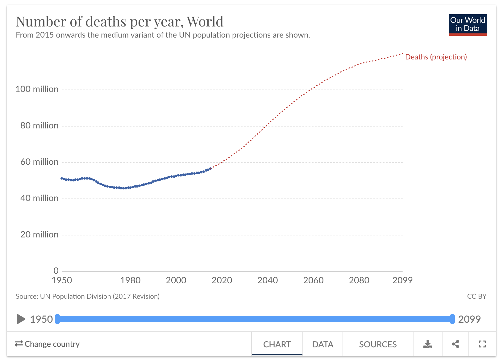
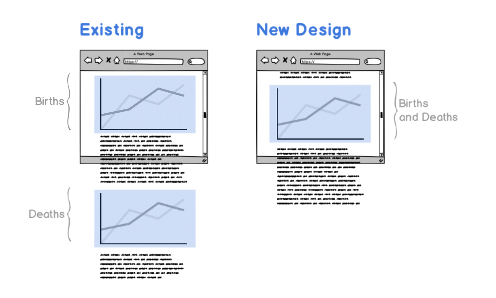

# Assignment 3 & 4
02 Febuary 2020 
[Back to main page](/README.md)

# The data

### The data I chose

The data visualisation I chose is in the passage about “How many people die and how many are born each year?” Which is published by Our world in data.
https://ourworldindata.org/births-and-deaths

Two charts that I focus on are the line graphs about the Number of birth per year (World) and the Number of death per year (World). I chose these visualizations because I can see rooms for development, and the insight convey from these graphs can bring about several opportunities and understandings.  For instance, what social trends might emerge from the change in birth and death rate or what we could prepare for the less growth rate in global populations etc.
https://ourworldindata.org/grapher/number-of-births-per-year  
https://ourworldindata.org/grapher/number-of-deaths-per-year

### The design critique

After I review the grahps together with the surrounding text, I analysed through several aspects using Stephen Few's Data Visualization Effectiveness Profile.

Usefulness - 7: The audiences of the site like Our world in data might have particular interest in data or professionals who seeks references to other contents. Therefore, to provide a thorough aspect of data (separated death and birth dataset) is useful because this allows the audiences to interpret and utilize further for different purposes. However, to illustrate the insight from these two separate graphs, users still need some effort.

Completeness - 6: The main insight of the context is whether the total number of world population will grow, which is reflected from the difference between the number of death and birth each year. However, it is not comprehensive from only reading each graph alone. Therefore, to me, each figure does not do well in completeness.

Perceptibility - 9: The line graph is simple to illustrate trends and does not contain unnecessary graphical elements. The difference in the line format to represent recorded data and predicted data is easy to notice and understand.

Truthfulness - 10: The information is depicted accurately and in a reliable manner with a citation for data source.

Intuitiveness - 9: Most of the audience is familiar with the line graph, and these graphs do not require a learning curve to understand.

Aesthetics - 8: The graphs look nice, but some issues about spacing and typography selection reduces the total score in this area. The space between the subtopic or the description and the line graph in the number of births graph is too narrow that the information from the line is distracted. The font used in the subheading can be too small, and there are too many font styles in this small simple chart/

Engagement - 7: Because what I have mentioned in the completeness section about the inability to convey the main insight, it loses the opportunity to encourage the audience to discuss further. Moreover, the topic of the graph is redundant with the information it conveys and does not help to point out what might be an interesting insight from the data.
  
  
### What I want to improve

From the rationales I discussed, the significant issues are about how efficient the graph can convey the insight about the impact of these births and deaths rate. However, the context or the media these graphs are published may be the reason why the designer has designed the graph this way. For example, the aim of the website may be to purely provide no or minimal interpretation and to avoid bias. To me, I would like to highlight this insight and make the graph easier to interpret for the mass.

# Ideation and Wireframe
### The context

The key insight is about the overall growth in population, which derives from the difference in the number of births and deaths in each year. The existing location of the graph on the screen makes it difficult to compare the number of births and deaths because the audiences cannot see both figures at the same time or in one screenshot (Both in the computer screens or mobile devices). Scrolling back and forth is also troublesome. Therefore, I decided to design a new graph which combines information about births and deaths. This way, users will be able to compare the information within one screenshot in which the chart is published among the text.

### The graph sketches

I used Tableau to draft the mockup and Adobe Illustrator to make some adjustments to my mockup (sketches). The two concepts I created are one with an additional line for “difference” (Yellow line) and another one with shading to help emphasizing the differences in the areas.
 

 
 <b>Concept 01:</b> 

 
  <b>Concept 02:</b> 
  

 

